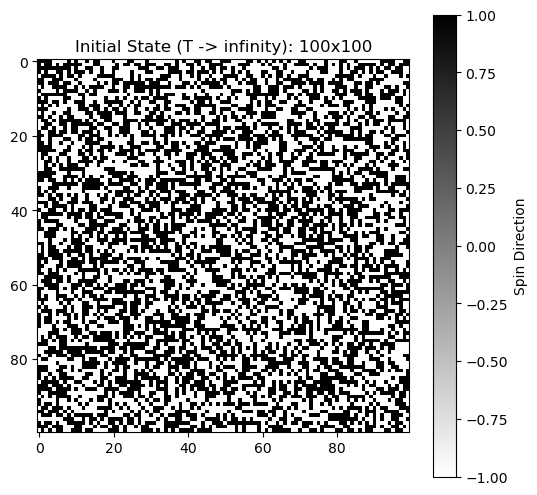
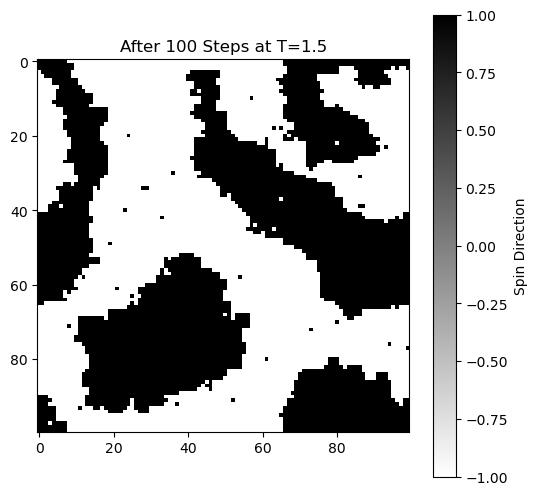
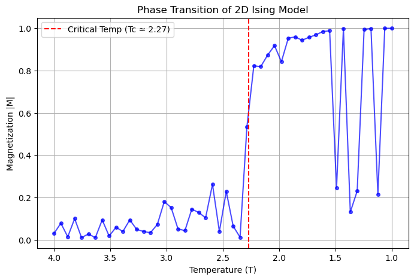

# 2D Ising Model Simulation with Metropolis Algorithm

A Python implementation of the 2D Ising Model to demonstrate **Phase Transitions** and **Ferromagnetism**.
This project simulates how microscopic spin interactions lead to macroscopic order (Magnetization) using the Metropolis-Hastings algorithm.

## 📊 Simulation Results

### 1. Phase Transition (High Temp vs Low Temp)
Visualizing the emergence of magnetic domains (order) from thermal noise (disorder).

| High Temperature ($T > T_c$) | Low Temperature ($T < T_c$) |
|:---:|:---:|
|    **Disordered State** (Random Noise) |    **Ordered State** (Magnetic Domains) |

### 2. Criticality & Magnetization
Observing the phase transition around the critical temperature ($T_c \approx 2.27$). The graph shows the symmetry breaking where magnetization $|M|$ rises sharply.

---

## 🧮 Theoretical Background

### The Hamiltonian
The energy of the system is defined by:

$$H = -J \sum_{\langle i, j \rangle} s_i s_j$$

- $s_i = \pm 1$: Spin state (Up/Down)
- $J > 0$: Ferromagnetic interaction constant (Neighboring spins want to align)
- $\sum_{\langle i, j \rangle}$: Sum over nearest neighbors

### The Algorithm (Metropolis Method)
I implemented the **Metropolis-Hastings algorithm** to simulate thermal fluctuations:
1. Pick a random spin.
2. Calculate energy change $\Delta E$.
3. Flip the spin if $\Delta E < 0$, or with probability $e^{-\Delta E / k_B T}$ if $\Delta E > 0$.

---

## 🛠 Technologies Used
- **Language:** Python 3.10
- **Libraries:** NumPy, Matplotlib
- **Environment:** Jupyter Notebook on WSL2 (Ubuntu)

## 🚀 Future Work
- **Critical Exponents:** Calculating susceptibility ($\chi$) and heat capacity ($C_v$) to study universality classes.
- **Neuroscience Connection:** I am interested in learningng this energy-based model to **Hopfield Networks** and Boltzmann Machines to simulate the memory.

## Acknowledgements
This project was implemented with the assistance of AI tools (Google Gemini) for code generation, debugging, and theoretical explanations. The simulation logic and physical interpretations were verified by the author.

---
*Author: Ko Akamine (Kumamoto University, Physics)*